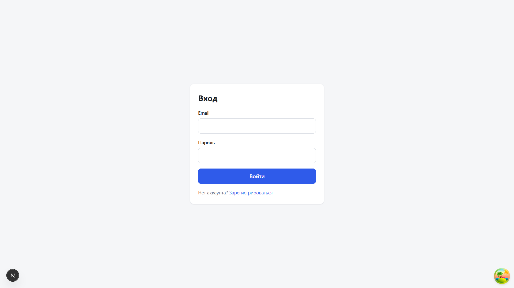
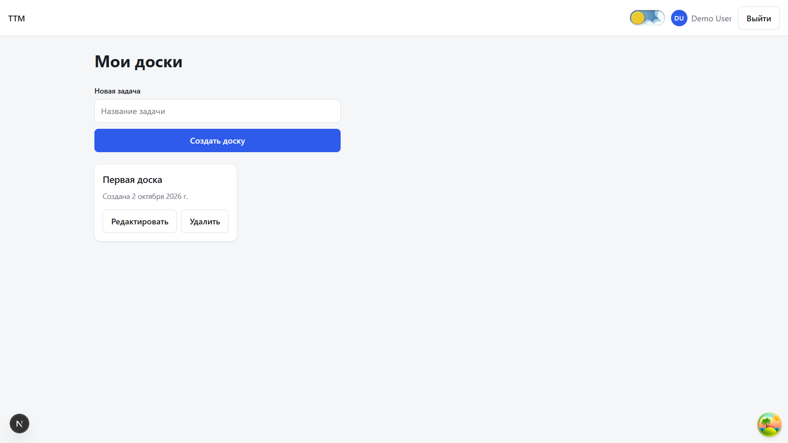
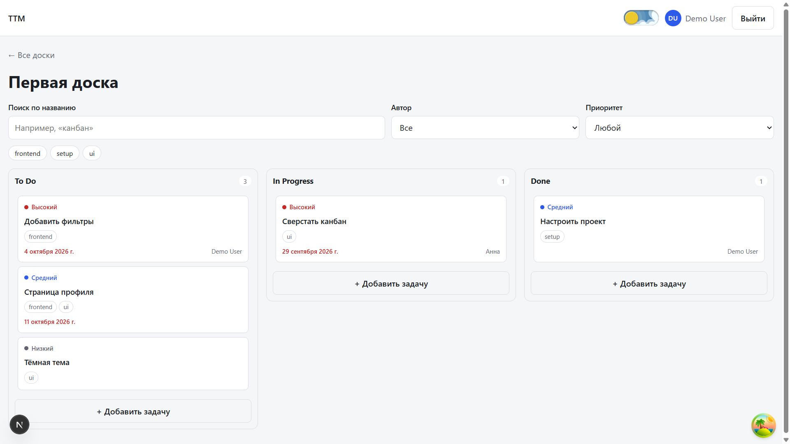
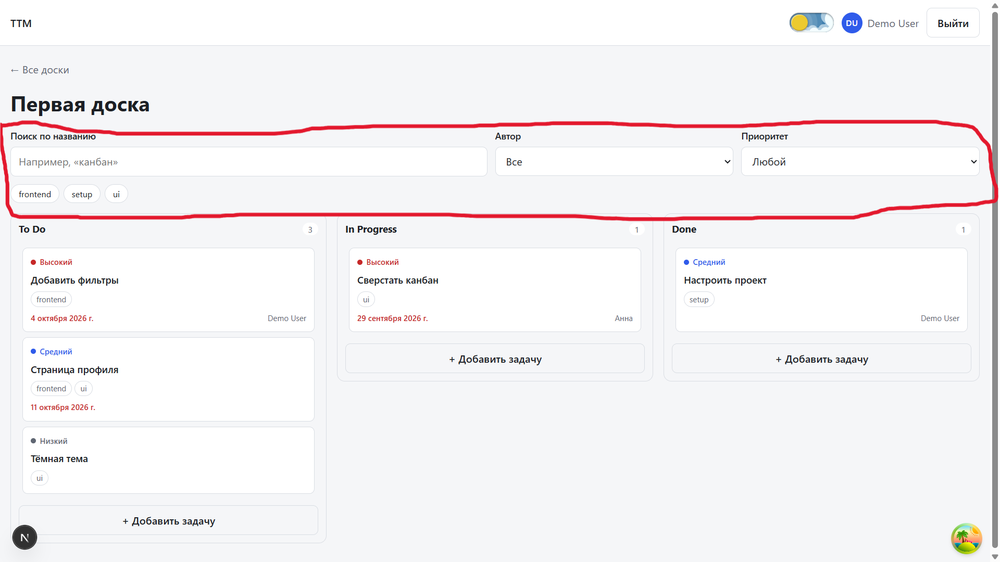
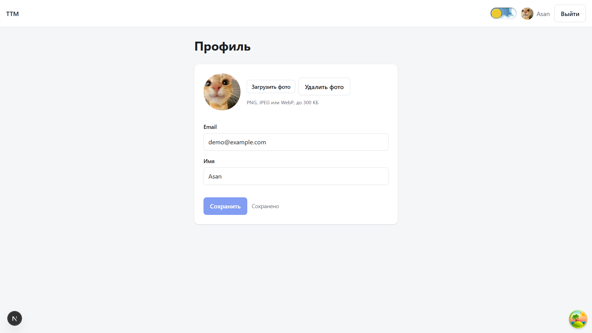
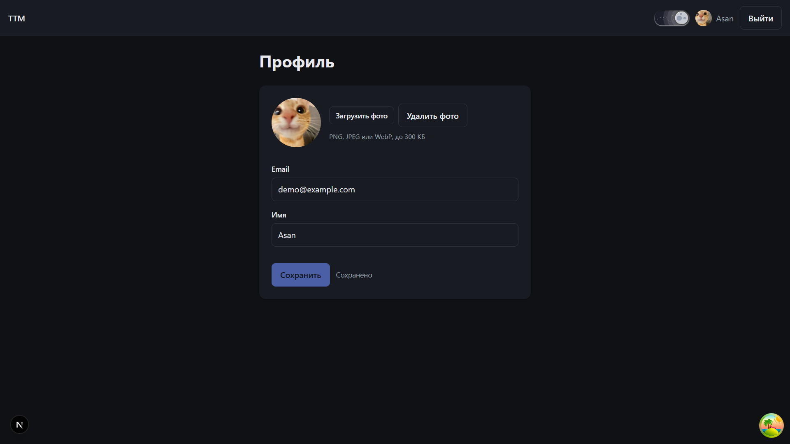
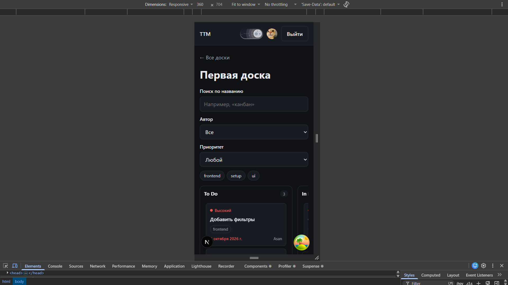
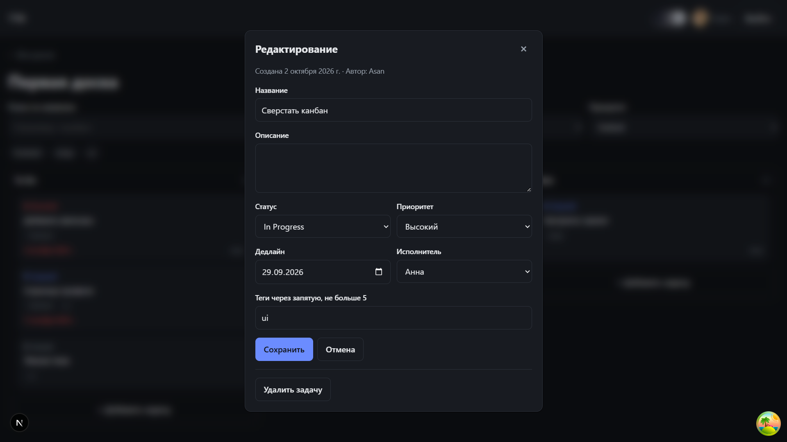

# Документация

**Ссылка на vercel:** https://team-task-manager-tz.vercel.app

**Демо-аккаунты:**

| N   | Email              | Пароль     |
| --- | ------------------ | ---------- |
| 1   | `demo@example.com` | `demo1234` |
| 2   | `anna@example.com` | `anna1234` |

Второй аккаунт нужен чтобы проверить фильтры

---

## Скриншоты реализации функциональных требований

| Авторизация                            | Список досок                            |
| -------------------------------------- | --------------------------------------- |
|  |  |

| Канбан-доска                            | Фильтрация и поиск                            |
| --------------------------------------- | --------------------------------------------- |
|  |  |

| Профиль пользователя                            | Тeмная и светлая тема                            |
| ----------------------------------------------- | ------------------------------------------------ |
|  |  |

| Адаптивная вeрстк               | Структура задачи                            |
| ------------------------------- | ------------------------------------------- |
|  |  |

---

## Функциональность

- **Авторизация:** Вход и регистрация с валидацией, защищeнные маршруты, сессия сохраняется после перезагрузки.
- **Доски:** Пользователь видит только свои доски, может создавать, переименовывать и удалять их.
- **Канбан:** Три колонки: To Do, In Progress, Done. Создание, редактирование и удаление задач, карточка задачи в модальном окне, перенос карточек между колонками перетаскиванием.
- **Задача:** название, описание, приоритет (low / medium / high), теги, дедлайн, исполнитель, дата создания.
- **Фильтрация и поиск:** По названию, автору, приоритету и тегам — с мгновенным результатом.
- **Профиль:** Смена имени и аватара.
- **Тeмная и светлая тема:** с сохранением выбора.
- **Адаптивная вeрстка:** от 360 px.

---

## Стек

| Задача               | Решение                              |
| -------------------- | ------------------------------------ |
| Фреймворк            | Next.js 16 (App Router)              |
| Серверное состояние  | TanStack Query                       |
| Клиентское состояние | Zustand                              |
| Формы и валидация    | React Hook Form, Zod                 |
| HTTP                 | Axios                                |
| Мок-бэкенд           | MSW                                  |
| Перетаскивание       | dnd-kit                              |
| Стили                | CSS Modules                          |
| Качество кода        | ESLint, Prettier, Husky, lint-staged |
| CI/CD                | GitHub Actions, Vercel               |

---

## Запуск

```bash
git clone https://github.com/draharde/team-task-manager-tz.git
cd team-task-manager-tz
npm install
npm run dev
```

Откройте http://localhost:3000 и войдите под демо-аккаунтом, который указан в начале.

---

## Скрипты

| Команда                | Что делает                      |
| ---------------------- | ------------------------------- |
| `npm run dev`          | dev-сервер                      |
| `npm run build`        | продакшен-сборка                |
| `npm run start`        | запуск продакшен-сборки         |
| `npm run lint`         | проверка ESLint                 |
| `npm run lint:fix`     | ESLint с автоисправлением       |
| `npm run format`       | форматирование Prettier         |
| `npm run format:check` | проверка форматирования         |
| `npm run typecheck`    | проверка типов TypeScript       |
| `npm run check`        | lint + typecheck + format:check |

---

## Структура

Проект построен по [Feature-Sliced Design](https://feature-sliced.design/ru):

Подробнее в [ARCHITECTURE.md](docs/ARCHITECTURE.md).
